

# gm-phd
C++ implementation of GM-PHD filter.

## Point target
Based on: 
* "Probability Hypothesis Density Filter Implementation and Application", Zachary Prihoda, Arec Jamgochian, Ben Moore, Bernard Lange

## Extended target
Based on:
* "A GAussian Mixture PHD filter for Extended Target Tracking", Karl Granstrom, Christian Lundquist, Umut Orguner
* "Extended Target Tracking Using a Gaussian Mixture PHD Filter", Karl Granstrom, Christian Lundquist, Umut Orguner
* "Gaussian Mixture PHD filter for Multiple Maneuvering Extended Targets Tracking", Wenling Li, Yingmin Jia, Junping Du and Fashan Yu

## Some trajectory examples

### 1.
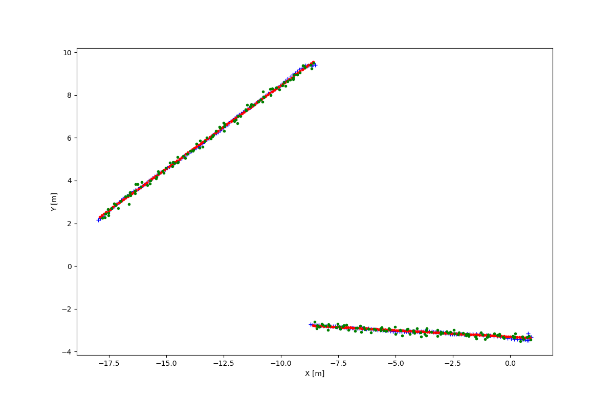

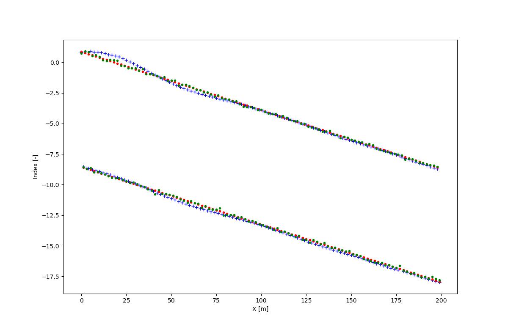

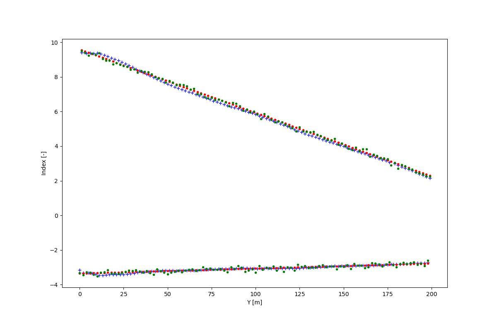

### 2.
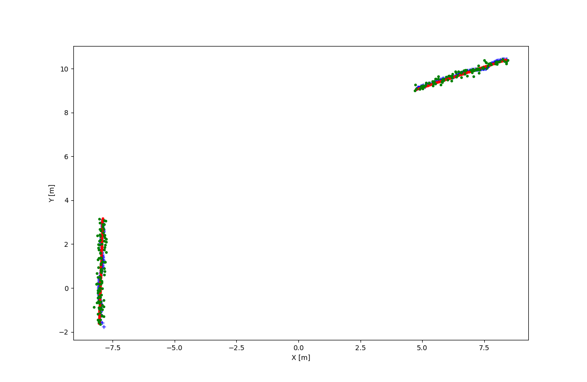

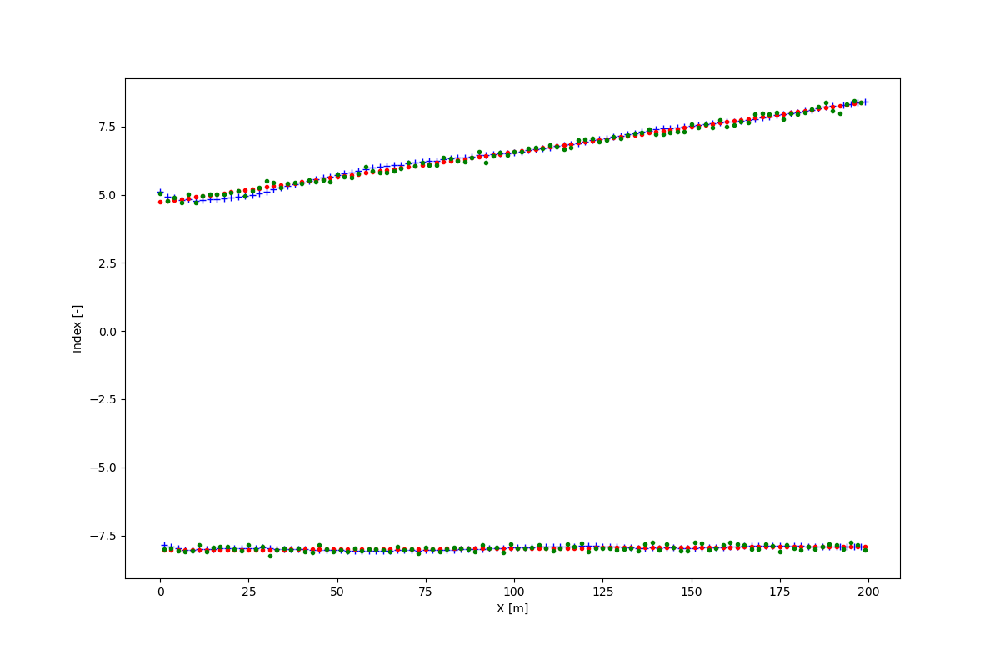

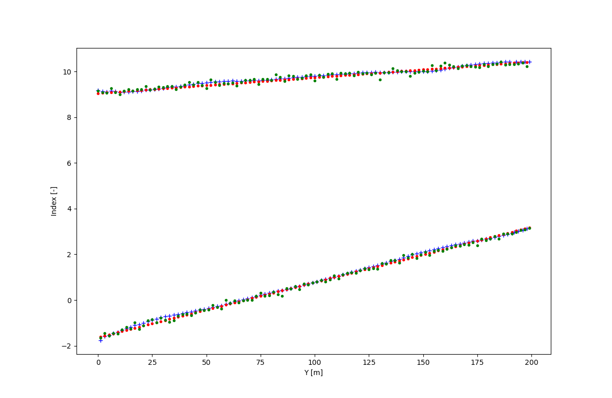

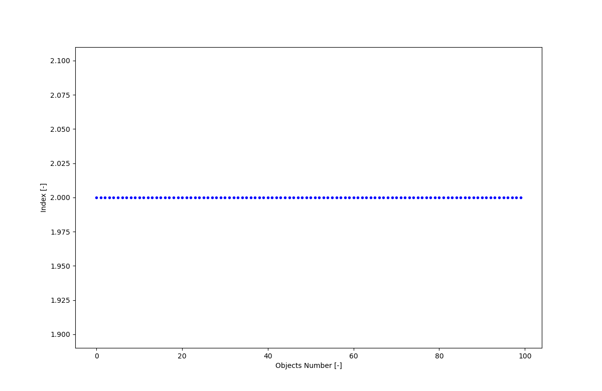

### 3.
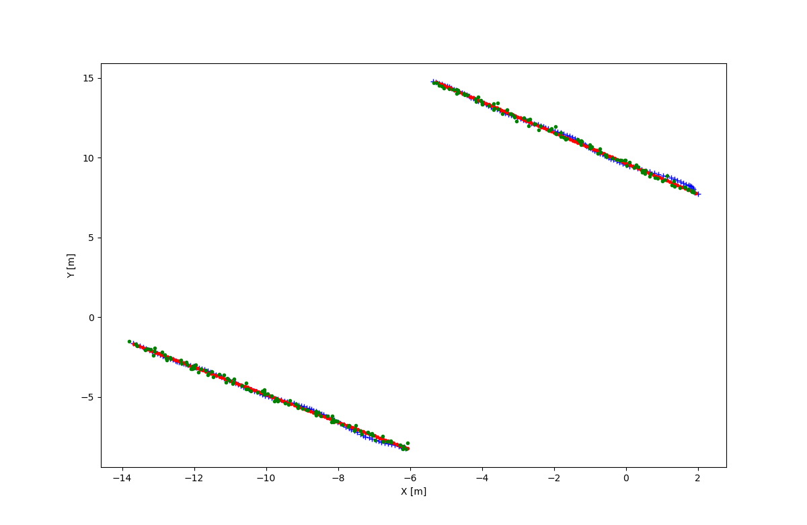

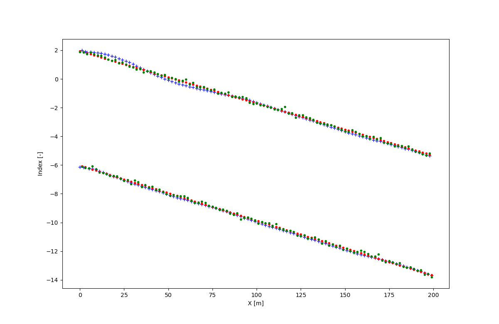

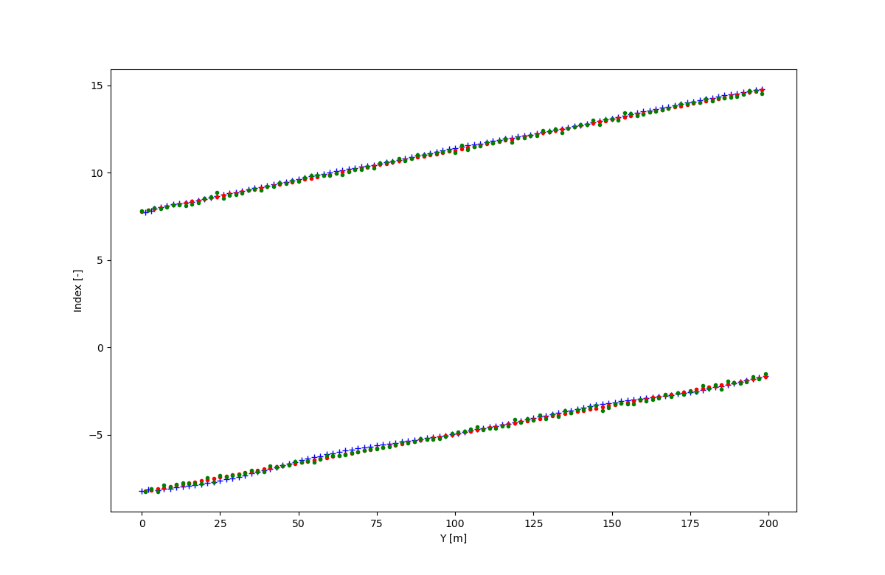

### 4.
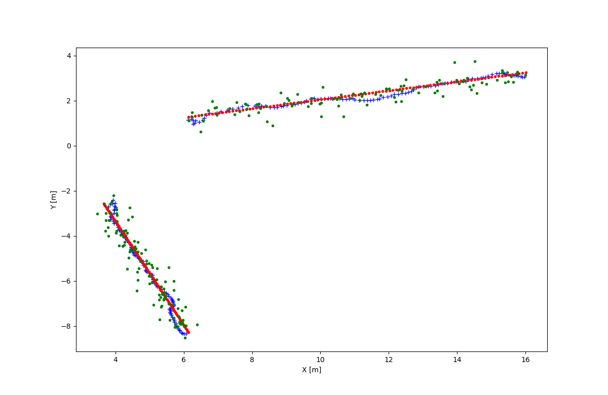

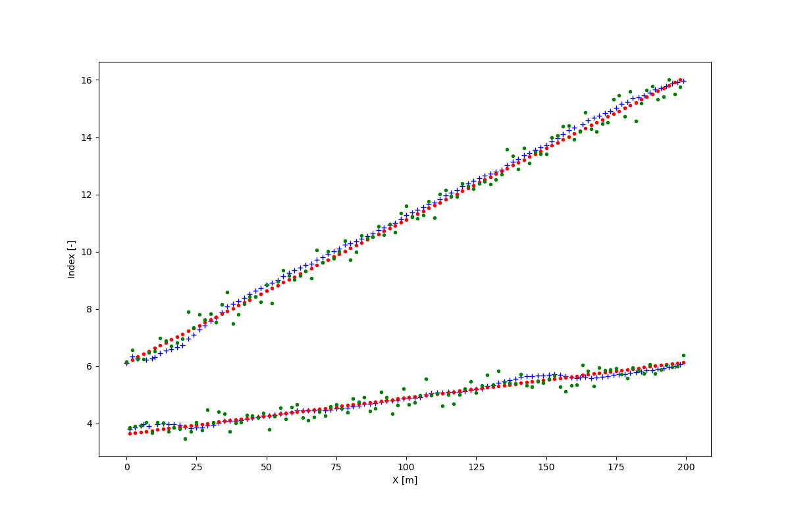

### 5.
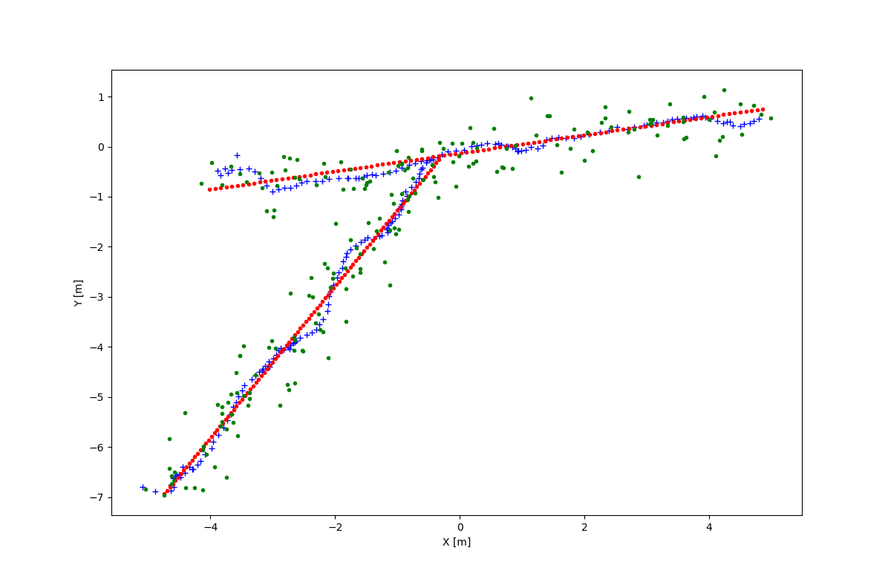

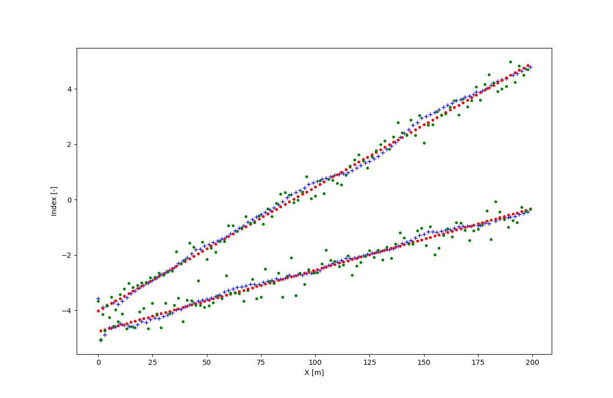

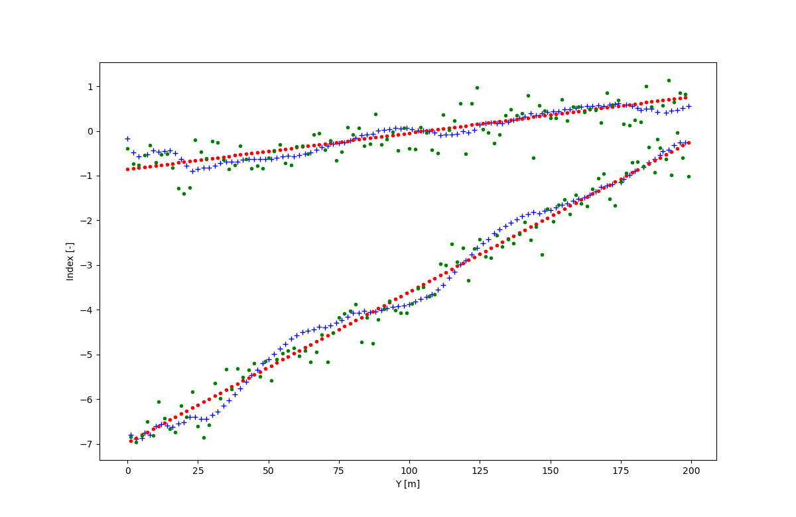

